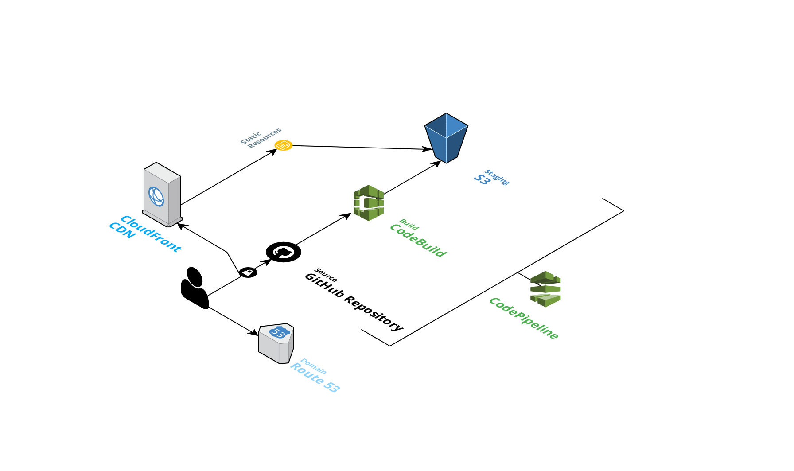

## AWS S3 + CodePipeline Depoly

> Create smart AWS diagrams [Cloudcraft](https://cloudcraft.co/)

## Production

* [S3](https://aws.amazon.com/ko/s3/) : 최고의 확장성과 데이터 가용성 및 보안과 성능을 제공하는 객체 스토리지 서비스

* [CodeBuild](https://aws.amazon.com/ko/codebuild/) : 소스 코드를 컴파일하는 단계부터 테스트 실행 후 소프트웨어 패키지를 개발하여 배포하는 단계까지 마칠 수 있는 완전관리형의 지속적 통합 서비스

* [CodePipeline](https://aws.amazon.com/ko/codepipeline/) : 빠르고 안정적인 애플리케이션 및 인프라 업데이트를 위해 릴리스 파이프라인을 자동화하는 데 도움이 되는 완전관리형 [지속적 전달](https://aws.amazon.com/ko/devops/continuous-delivery/) 서비스

* [Identity and Access Management(IAM)](https://aws.amazon.com/ko/iam/) : AWS 서비스와 리소스에 대한 액세스를 안전하게 관리할 수 있습니다.

* [Route 53](https://aws.amazon.com/ko/route53/) : 높은 가용성과 확장성이 뛰어난 클라우드 [Domain Name System(DNS)](https://aws.amazon.com/ko/route53/what-is-dns/) 웹 서비스

* [CloudFront](https://aws.amazon.com/ko/cloudfront/) : 짧은 지연 시간과 빠른 전송 속도로 데이터, 동영상, 어플리케이션 및 API를 전 세계 고객에게 안전하게 전송하는 고속 콘텐츠 전송 네트워크(CDN) 서비스

* [Certificate Manager](https://aws.amazon.com/ko/certificate-manager/) AWS 서비스 및 연결된 내부 리스소에 사용할 공인 및 사설 SSL/TLS(Secure Sockets Layer) 인증서를 손쉽게 프로비저닝, 관리 및 배포를 지원하는 서비스
